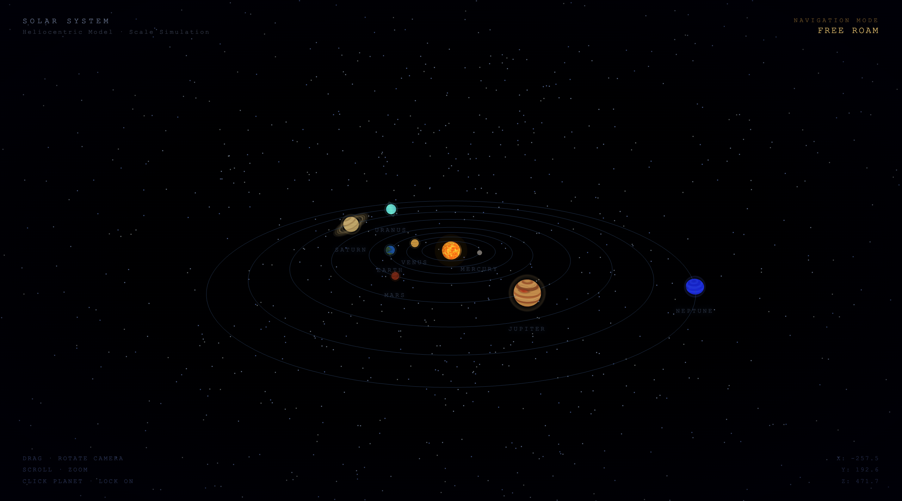

# Safayi

Low-poly 3D solar system with walkable planet surfaces. Two-file scene system — no bundler, no build step, vanilla Three.js r128 from CDN.

## What's built

- **Solar system** — 8 planets with procedural textures, animated Sun shader, orbit rings, planet labels, click-to-lock info panel
- **Planet surface** — Flat terrain (600×600) with per-planet procedural ground texture, 40×40 build grid with hover highlight, humanoid player with walking animation, isometric & third-person camera (V to toggle), WASD/arrow movement, mouse aim
- **Fixed timestep** game loop (60 Hz physics, decoupled from render)

## What's next

- [ ] Click-to-place building foundations
- [ ] Building system (walls, machines, infrastructure)
- [ ] Resource nodes (scatter ore, wood, water)
- [ ] Harvesting & gathering mechanics
- [ ] Inventory & HUD
- [ ] Crafting & research
- [ ] Survival mechanics (health, power, life support)
- [ ] Base defence & warfare
- [ ] Inter-planetary travel & logistics
- [ ] Economy & trade
- [ ] Territory control & faction maps
- [ ] Dynamic seasons & weather
- [ ] Fighter jet endgame
- [ ] LLM-powered bot AI (blocked — no local LLM capable on 16GB M1, no budget for cloud)

## Controls

| Key | Action |
|-----|--------|
| WASD / Arrows | Move |
| Mouse | Aim |
| V | Toggle camera mode |
| Scroll | Zoom |
| Click planet | Lock on / info |
| Enter Planet | Navigate to surface |
| ESC | Back to space |

## Files

| File | Scene |
|------|-------|
| `solar-system.html` | Solar system view |
| `surface.html` | Planet surface view |
| `progress.png` | Current build screenshot |
